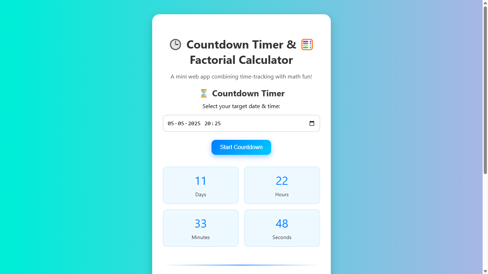
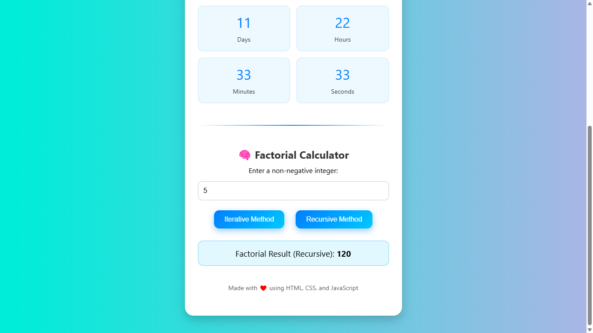
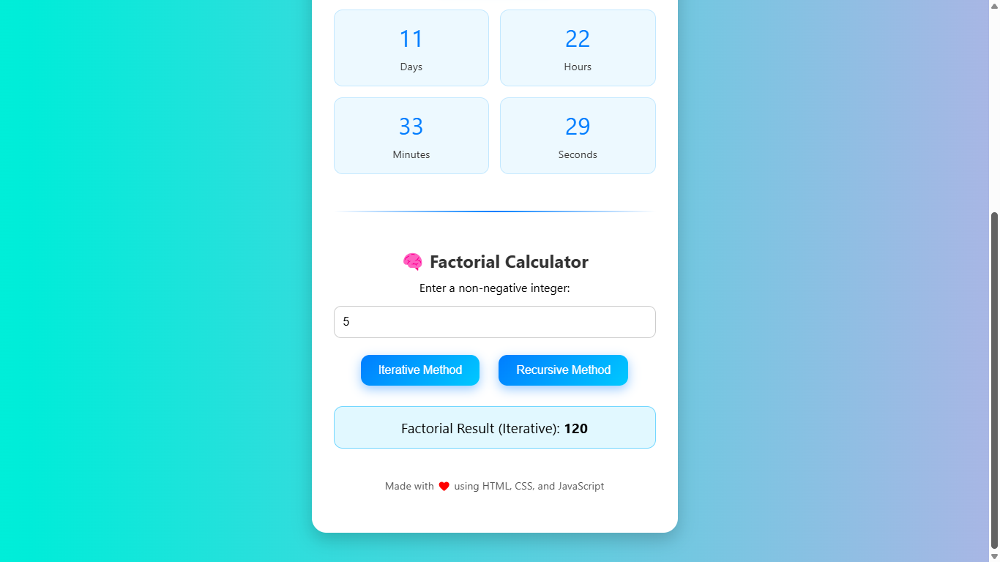
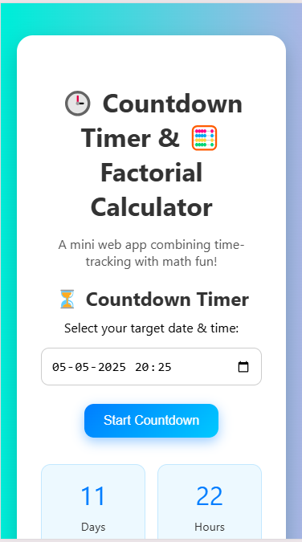
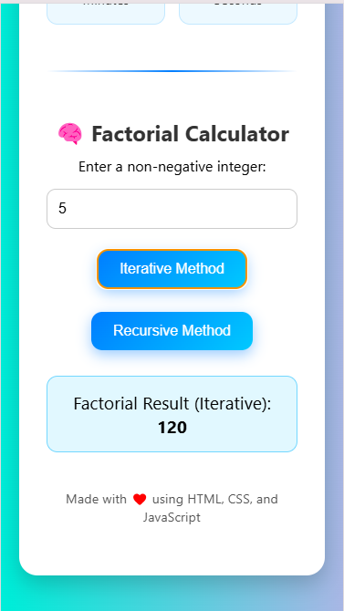

# ⏳ Countdown Timer & ⚙️ Factorial Calculator Web App

A modern, responsive, and visually appealing web application that combines a **Countdown Timer** and a **Factorial Calculator** (both iterative and recursive). This project is built using **HTML, CSS, and JavaScript** with smooth animations and user-friendly design.

---

## 🚀 Features

### 🎯 Countdown Timer
- Select any future date & time
- Live countdown display (Days, Hours, Minutes, Seconds)
- Responsive UI with animated transitions
- Celebratory effect when countdown completes (🎉)

### 🔢 Factorial Calculator
- Enter any positive integer
- Choose between **Iterative** or **Recursive** methods
- Instant result display with mathematical formatting
- Input validation for user safety

---

## 🛠️ Technologies Used

- **HTML5** – Structure of the web application
- **CSS3** – Styling and responsive layout with animations
- **JavaScript** – Logic for countdown and factorial calculations

---

## 📸 Screenshots

### 🖼 Countdown Timer UI



### 🖼 Factorial Calculator UI


---


### 🖼 Responsive Mobile View


---


---

## 🧪 How to Use

1. **Clone this repository**  
   ```bash
   git clone https://github.com/Roni-Seikh/VirtuNexa_Countdown-Factorial-Webapp.git
   ```

2. **Navigate to the project directory**
   ```bash
   cd countdown-factorial-webapp
   ```

3. **Open `index.html` in any browser**

   No additional dependencies or installations needed.

---

## 📂 Project Structure

```
📁 countdown-factorial-webapp
├── index.html
├── style.css
├── script.js
└── screenshots
    ├── countdown-timer-ui.png
    ├── factorial-recursion-calculator-ui.png
    |── factorial-iterative-calculator-ui.png
    └── mobile-view.png
```

---

## ✨ Live Demo

👉 [View Live](https://flourishing-entremet-d5a3a6.netlify.app/)

---

## 👨‍💻 Author

**Roni Seikh**  
B.Tech CSE | Web & App Developer | Data Enthusiast  
🔗 [GitHub](https://github.com/Roni-Seikh) | [LinkedIn](https://linkedin.com/in/roniseikh)

---

## 📃 License

This project is licensed under the MIT License.
